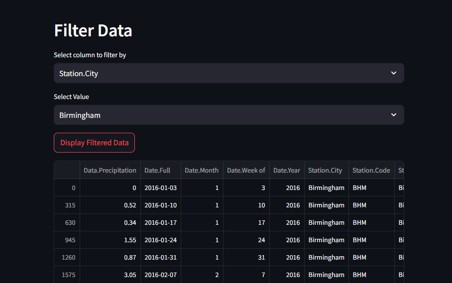

# Simple Data Dashboard 📊

## Overview 🌟
This **Streamlit** app allows users to upload a CSV file and interactively explore the data through several features, including previewing the data, viewing summary statistics, filtering the data, and plotting it using line charts. The app provides an intuitive interface to easily perform data analysis tasks without requiring any coding skills. 

## Features 🚀
- **File Upload**: 📂 Upload a CSV file to load data into the app.
- **Data Preview**: 👀 View the first few rows of the dataset for a quick overview.
- **Data Summary**: 📈 Get a statistical summary of the dataset (mean, standard deviation, min, max, etc.).
- **Data Filtering**: 🔍 Filter data based on column values and display the filtered dataset.
- **Data Plotting**: 📉 Visualize the data by plotting a line chart between selected columns.

## Requirements 🧰
To run this project, you need to have the following Python libraries installed:
- **streamlit**: Framework to create interactive web apps.
- **pandas**: For handling and analyzing CSV data.
- **matplotlib**: For plotting graphs (though not used directly in this code, it's a commonly used library for data visualization).
- **numpy**: For numerical operations, though it is indirectly used through pandas.

To install the required libraries, run the following command:

```bash
pip install streamlit pandas matplotlib numpy
```
## How to Use 🛠️

1. **Upload a CSV File**: 📤 Click on the "Choose a CSV File" button to upload a CSV file.
2. **Data Preview**: 👀 After uploading the file, the app will display a preview of the first few rows of your dataset.

3. **Data Summary**: 📊 The app will automatically show summary statistics for the dataset (e.g., mean, standard deviation).

4. **Filtering Data**:

- Select a column from the dropdown menu to filter the data. 🎯

- Choose a specific value from that column to filter the rows. 🔢

- Click the "Display Filtered Data" button to show the filtered dataset. 🔽
5. **Plotting Data**:

- Select columns for the x and y axes from the dropdown menus. 📈

- Click the "Plot the Data" button to visualize the relationship between the selected columns using a line chart. 📊

## Snapshots 🎆

- Here are some Snaps from the WEB





